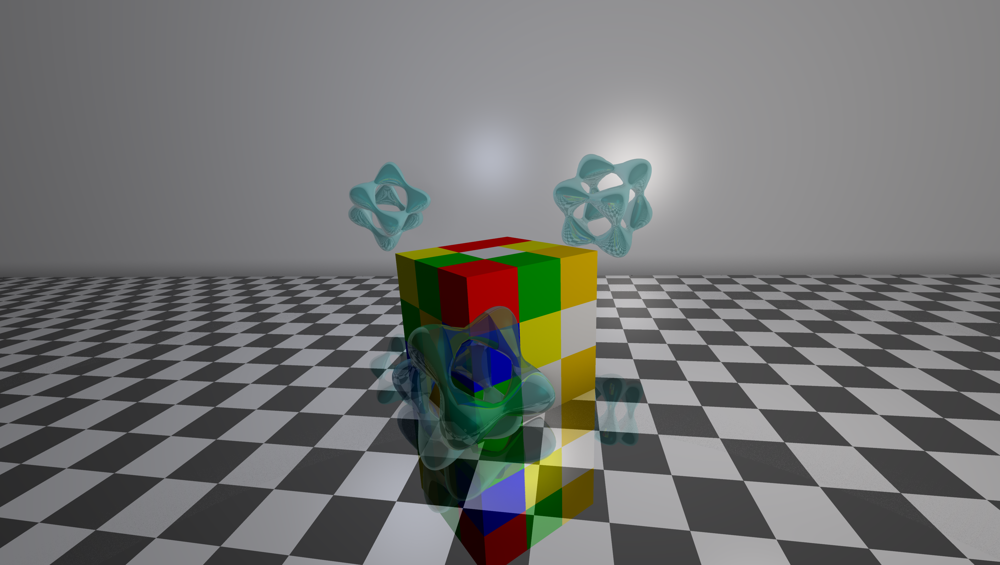

### 🖼️ Image: `Cubes.png`

**Description:**
This render showcases **reflection** and **transparency**.
At the center, a **Rubik's Cube** (made with multiple squares) sits above a **chess-patterned ground plane** that also reflects its surroundings. Two **blue transparent Tanglecubes** fly around the Rubik's Cube.
Lighting two **white point lights**, and a **bluish ambient** for subtle tone. The result is rendered in **4K** with **adaptive antialiasing**, **Phong lighting**, and **ambient occlusion**.

**✅ Demonstrated Features:**
- Tanglecube primitive
- Reflective surfaces:
  - Ground plane
  - Tanglecubes
- Transparent surfaces
- Procedural chessboard texture (ground)
- Point lighting
- Ambient light (bluish tone)
- Phong lighting model
- Ambient occlusion
- Adaptive antialiasing
- 4K camera resolution, FOV 70°
