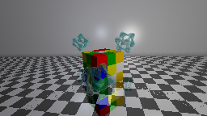

### 🖼️ Image: `Fractale.png`

**Description:**
This render presents a detailed **Menger Sponge–style fractal cube** rendered with **recursive geometry** and a stylized ground plane. The central object, a **fractalecube** with 3 levels of recursion.

The scene sits atop a **dirt-textured ground plane** using a **normal map** to simulate surface irregularities without increasing geometric complexity. Lighting is composed of a **neutral ambient light** and a **white point light** from above, creating contrast across the fractal structure's many faces and cavities.

Rendered in **4K** with **progressive rendering**, this scene benefits from **adaptive antialiasing**, **ambient occlusion**, and a **Phong lighting model**, producing soft shadows, detailed highlights, and realistic contact darkness.

**✅ Demonstrated Features:**

- Fractal primitive:
- Plane with: Dirt **normal map**, reflection
- Ambient lighting (neutral white)
- Single white point light (from top-front)
- Phong shading with:
- Ambient occlusion
- Adaptive antialiasing
- 4K resolution FOV 70°

**📚 References:**

