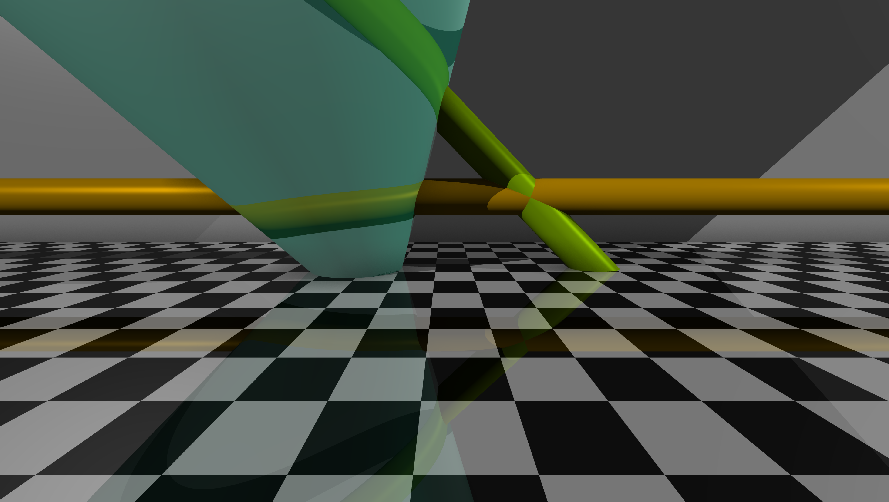

### 🖼️ Image: `InfiniteRefraction.png`

**Description:**
This render highlights complex **refraction** and **transparency** effects using infinite primitives.
A **chess-patterned ground plane** with reflection and a **gray wall** set the scene. At the center, a **light blue infinite cone** refracts and transmits light, intersected by two **infinite cylinders** — one **orange**, crossing laterally, and one **green**, cutting through diagonally.
Lighting and shading emphasize the interaction between transparent surfaces and their environment.

**✅ Demonstrated Features:**
- Infinite primitives:
  - Infinite cone (transparent & refractive)
  - Infinite cylinders (orange and green)
- Transparency
- Refraction
- Reflective surface (ground)
- Procedural chessboard texture
- Directional lighting (2x white)
- Ambient light (low intensity)
- Phong lighting model
- Ambient occlusion
- Adaptive antialiasing
- 4K camera resolution, FOV 70°
