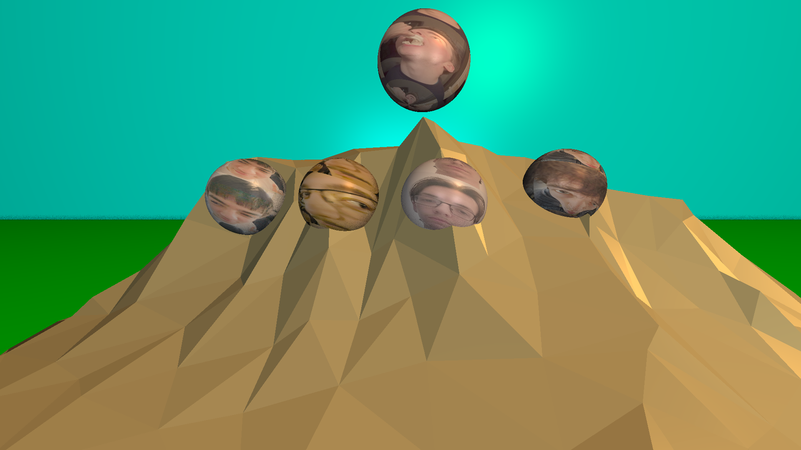
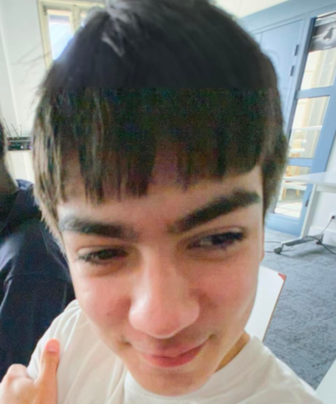
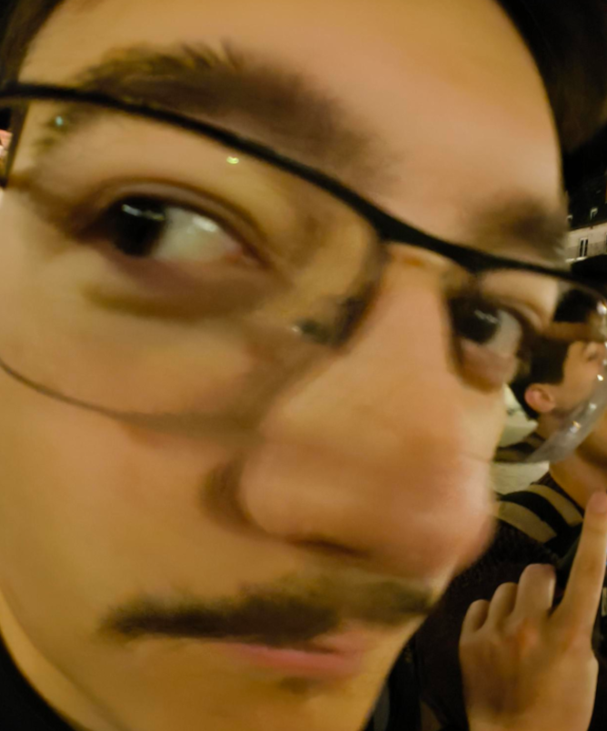
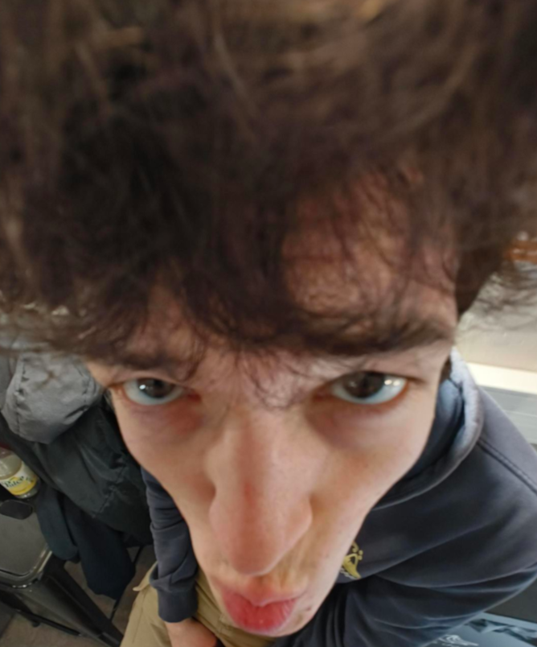

### 🖼️ Image: `MountainOfBogosses.png`

**Description:**
This whimsical render features a **mountain OBJ** placed on a **green ground plane**, with a **light blue wall plane** in the background.
Perched across the mountain are five **custom spheres**, each textured with a face, forming the “Mountain of Bogosses”:

- From left to right on the mountain slope:
  - Sphere with **Alban's face**
  - Sphere with **Eliott's face**
  - Sphere with **Nolan's face**
  - Sphere with **Noa's face**
- Floating above the summit:  
  - Sphere with **Tom's face**, watching over the rest

Lighting includes a **dark ambient light**, **two white point lights**, and a third **warm, sunset-colored point light** to bring soft color gradients and dramatic shading. The scene uses **Phong shading**, **ambient occlusion**, and **adaptive antialiasing**, all rendered in **4K** with a **70° field of view**.

**✅ Demonstrated Features:**
- `.OBJ` model import (mountain)
- Plane primitives (ground and wall)
- Texturing from image files (face-mapped spheres)
- Multiple point lights:
  - Two white
  - One sunset-colored
- Ambient light (low intensity)
- Phong lighting model
- Ambient occlusion
- Adaptive antialiasing
- 4K camera resolution, FOV 70°

**📚 References:**

