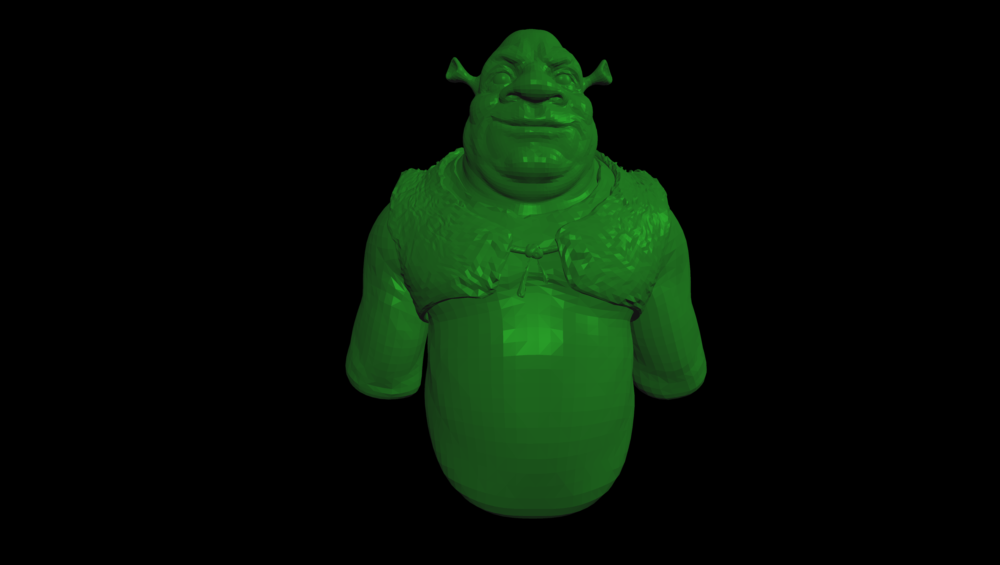

### 🖼️ Image: `ShrekOBJ.png`

**Description:**
This render demonstrates the raytracer's support for **complex 3D models** imported from `.OBJ` files.
The scene features a detailed mesh of **Shrek**, correctly **triangulated** and rendered with accurate shading. Lighting includes a **purple and a white directional light**, plus a **dark ambient light** to enhance depth and silhouette. The camera is set to **1920×1080 HD** resolution with a **70° field of view**, and **adaptive antialiasing** smooths the final result.

**✅ Demonstrated Features:**
- `.OBJ` file import
- Multiple directional lights (purple & white)
- Ambient light (low intensity)
- Phong lighting model
- Adaptive antialiasing
- Camera: 1920×1080 HD, FOV 70°

**📚 References:**
- [`shrek.obj`](../tests/obj_files/shrek.obj)
