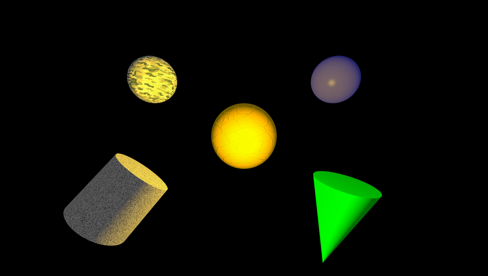

### 🖼️ Image: `Space.png`

**Description:**
This render presents a stylized "space" composition with varied materials and primitive types.
At the center is a **large yellow-orange sphere** representing a **sun**, enhanced with a **sun-like normal map** and illuminated by a **high-intensity point light**.
Surrounding it are several objects showcasing different rendering techniques:
- A **camouflaged sphere** using a texture file (top-left)
- A **flat blue sphere** (top-right)
- A **perlin noise textured limited cylinder** (bottom-left)
- A **flat green limited cone** (bottom-right)

Lighting includes a **white ambient light** for soft global illumination and a **bright point light** focused on the central sun. The scene uses **adaptive antialiasing**, **Phong shading**, and **ambient occlusion**, rendered in **4K** with a **70° FOV**.

**✅ Demonstrated Features:**
- Sphere with:
  - Normal map (sun-like texture)
- Textured sphere (camo file texture)
- Perlin noise texture (cylinder)
- Flat-colored sphere (blue)
- Limited primitives:
  - Cylinder (perlin noise)
  - Cone (green)
- Point light (high intensity)
- Ambient light (white)
- Phong lighting model
- Ambient occlusion
- Adaptive antialiasing
- 4K camera resolution, FOV 70°

**📚 References:**

