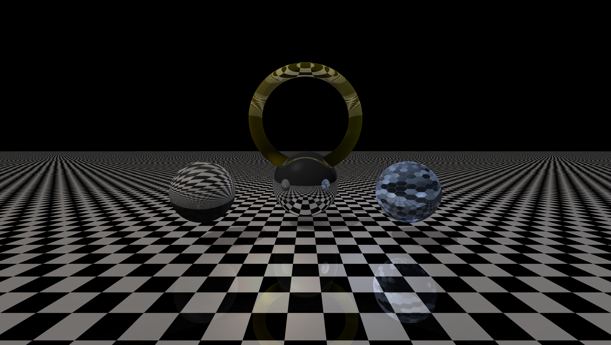
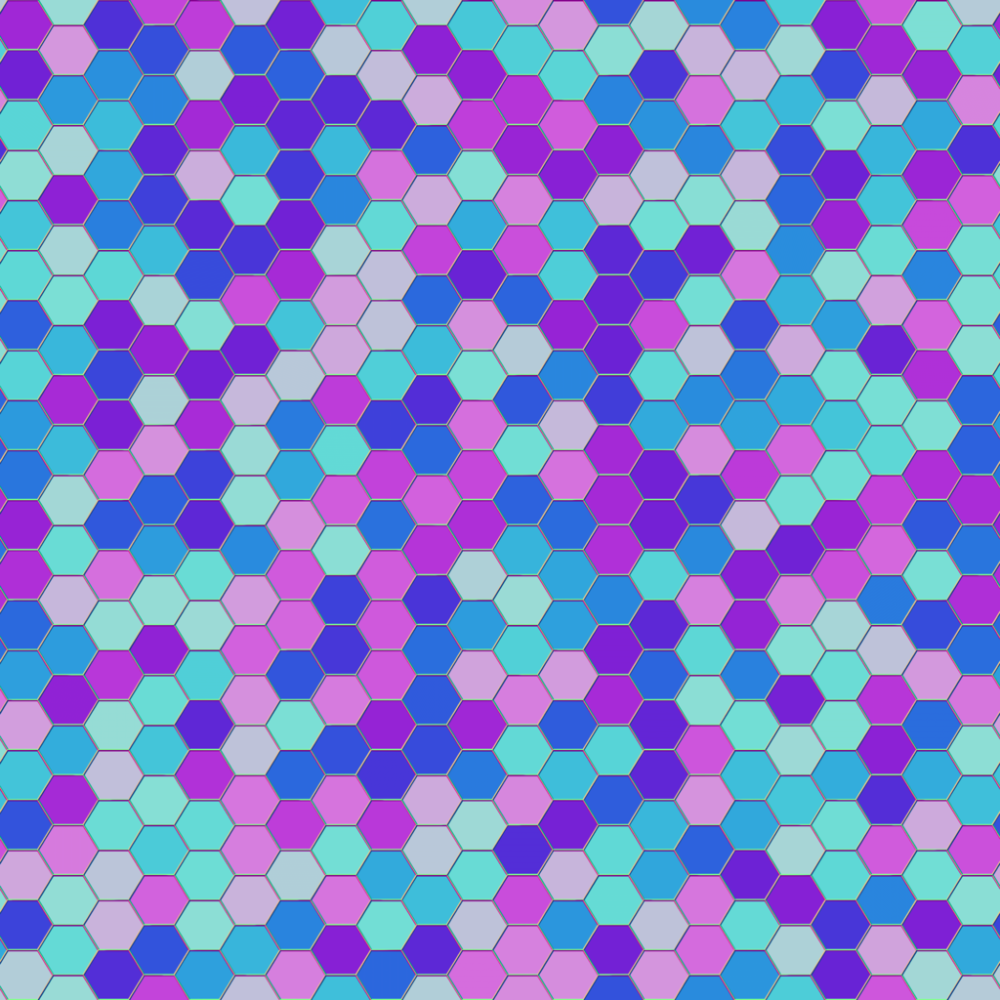

### 🖼️ Image: `TorusReflect.png`

**Description:**
This render showcases **reflection**, **refraction**, and **normal mapping** in a rich, multi-object scene.
At the center, a **reflective torus** sits above a **chess-patterned ground plane** that also reflects its surroundings. A **silver sphere** and a **blue metal-textured sphere** (with normal mapping and reflection) flank the torus. A **transparent white sphere** with **refraction** completes the scene.
Lighting includes a **warm directional light**, two **colored point lights** (orange & bluish), and a **bluish ambient** for subtle tone. The result is rendered in **4K** with **adaptive antialiasing**, **Phong lighting**, and **ambient occlusion**.

**✅ Demonstrated Features:**
- Torus primitive
- Reflective surfaces:
  - Torus
  - Ground plane
  - Silver sphere
  - Metal-textured sphere
- Refraction (white sphere)
- Procedural chessboard texture (ground)
- Normal mapping (blue metallic sphere)
- Point lighting:
  - Orange
  - Blue
- Directional lighting (warm tone)
- Ambient light (bluish tone)
- Phong lighting model
- Ambient occlusion
- Adaptive antialiasing
- 4K camera resolution, FOV 70°

**📚 References:**

