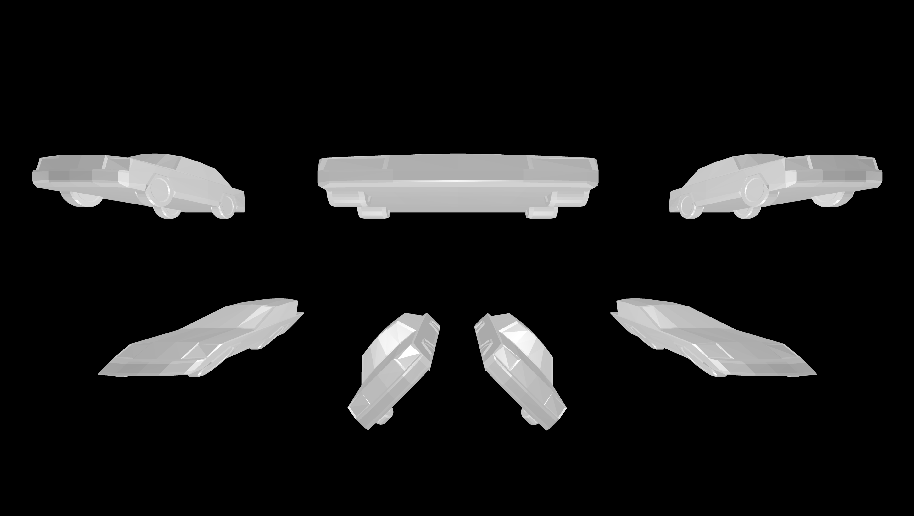

### 🖼️ Image: `Transformations.png`

**Description:**
This render showcases the raytracer's support for a wide range of **geometric transformations** applied to the same `.OBJ` model — a car.
Seven instances of the **car object** are displayed with distinct transformations to highlight how each affects the model's orientation, scale, or shape:

- **Slight left rotation**
- **Scaled** along the X axis (*x3*)
- **Slight right rotation**
- **Shear** along X axis (1)
- **Shear** along X axis (-1)
- **Z-axis rotation** of +45°
- **Z-axis rotation** of -45°

Lighting includes **five white point lights** placed strategically to emphasize shape deformations and shadows, along with a **white ambient light** to softly illuminate the entire scene. Rendering uses **adaptive antialiasing**, **Phong shading**, and **ambient occlusion**, at **4K resolution** with a **70° field of view**.

**✅ Demonstrated Features:**
- `.OBJ` model import (car)
- Transformations:
  - Rotation (x, y, z axes)
  - Scaling (x, y, z axes)
  - Shearing (x, y, z axes)
- Multiple point lights (5x white)
- Ambient light (white)
- Phong lighting model
- Ambient occlusion
- Adaptive antialiasing
- 4K camera resolution, FOV 70°

**📚 References:**
- [`car.obj`](../tests/obj_files/car.obj)
