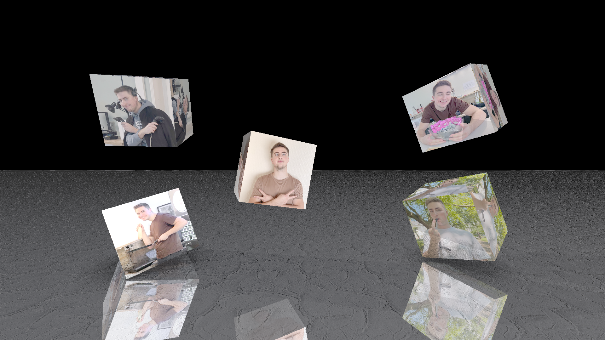
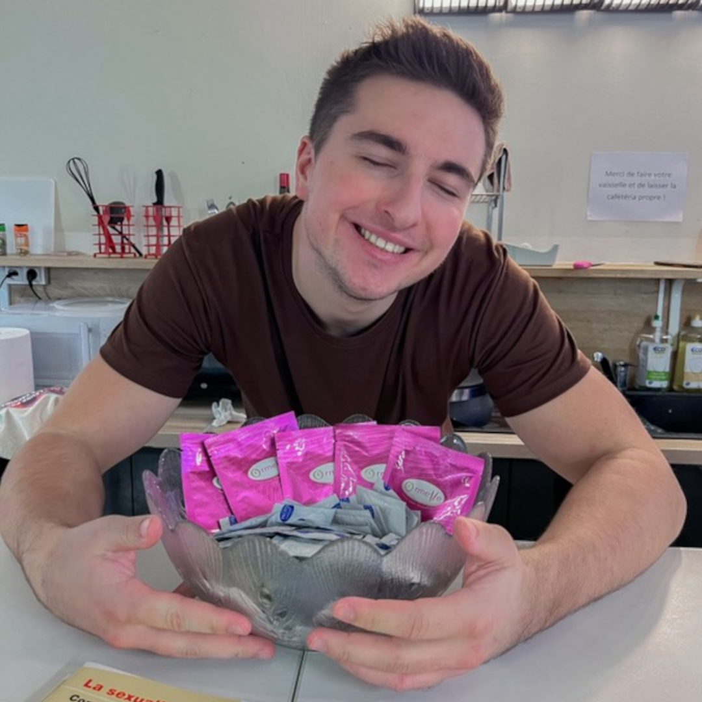
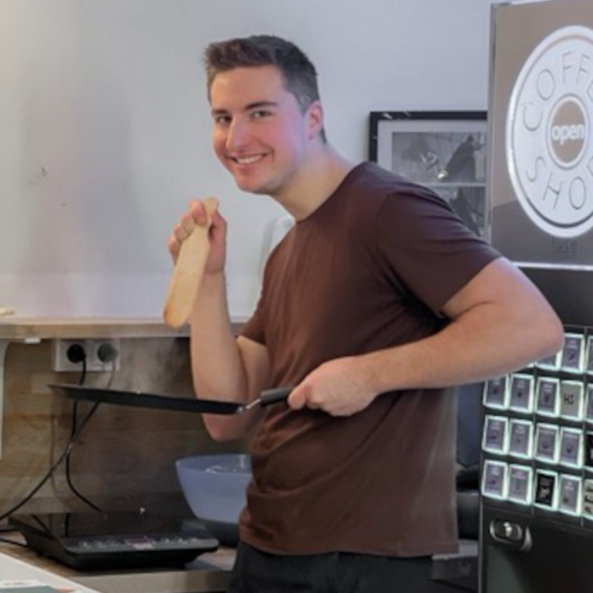

### 🖼️ Image: `WallOfTom.png`

**Description:**
This render features a **textured ground plane** with an earthy material and reflective properties, acting as a base for a unique display. Five textured squares, each mapped with **photos of Tom**, are arranged in the picture like a commemorative wall. The reflective surface subtly mirrors the images, enhancing the visual depth.

**✅ Demonstrated Features:**

* Plane with file texture (dirt/earth) and reflection
* Texturing from image files

**📚 References:**

